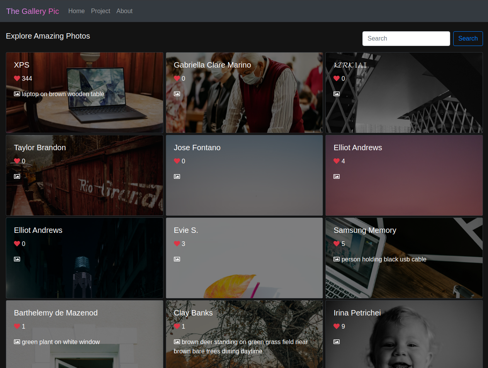
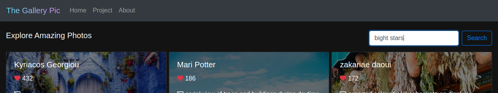
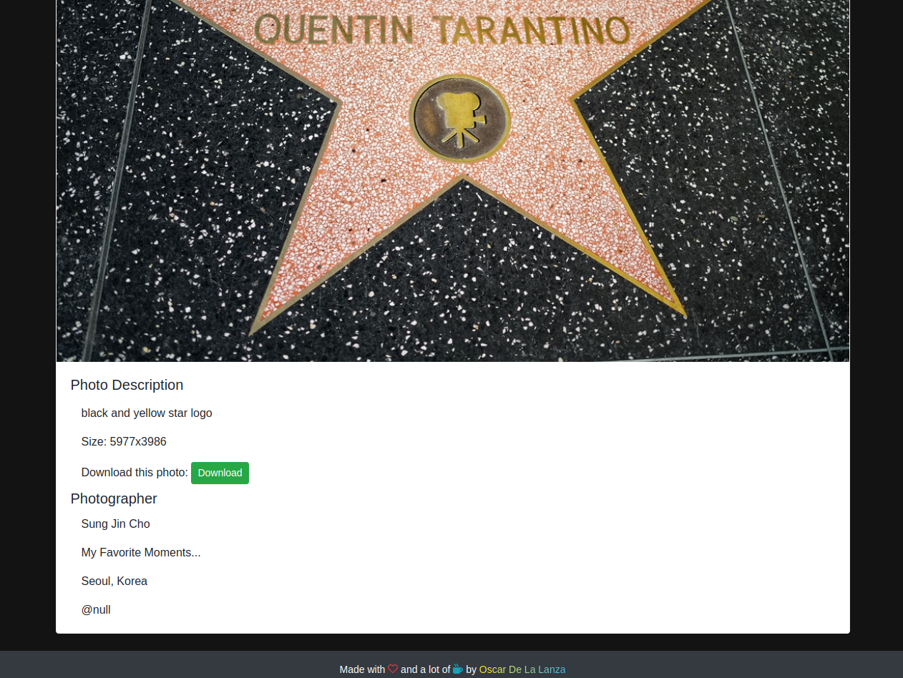

## Built With
- `JavaScript`, `HTML`, `CSS`
- `React`, `Redux`, `Unsplash-JS`, `Font Awesome`
- `React-Bootstrap`, `React-Redux`, `Redux-Thunk`, `Redux-Logger`, `React-router-dom`, `prop-types`, `node-sass`

## Live Demo
Here you can find a Live Demo of the project with its latest features [PictureThis!](
https://git.heroku.com/capstone2-picture-this.git/).

### Getting Started 

This project was bootstrapped with [Create React App](https://github.com/facebook/create-react-app).

### Prerequisites

If you want to get a local copy of this project first make you have installed `Git` and `node-js` in your local environment.

### Setup

Clone the project by running any of the following commands: 
- SSH: `git clone git@github.com:scotlin1293/Capstone-2.git`
- HTTPS: `git remote add origin https://github.com/scotlin1293/Capstone-2.git`
- GitHub CLI: `gh repo clone scotlin1293/Capstone-2.git`
- ZIP: [Download](https://github.com/scotlin1293/Capstone-2/archive/develop.zip)

Then go to [Unsplash Developers](https://unsplash.com/developers) and sign up as a developer.
- Create a new app and save your `Acces Key` and `Secret Key`.
- Inside `.env.example` you will find `REACT_APP_ACCESS_KEY=Unsplash_access_key` and `REACT_APP_SECRET_KEY=Unsplash_secret_key`
and replace `Unsplash_acces_key` and `Unsplas_secret_key` with the corresponding keys that you get from Unsplash developers.
- Then save `.env.example` file as `.env` 

### Install

Inside the project directory run `npm install` to install all the required `node_modules`.

Then execute `npm start` to run the app in the development mode.
Open [http://localhost:3000](http://localhost:3000) to view it in the browser.

### Usage

- Get the latest photographs from different artists since the beginning.

- Find what is relevant to you with in a simple way.

- Get all the info of your favorite photos with just a single click.

### Run tests

Execute `npm test` to launch the test runner in the interactive watch mode. See the section about
[running tests](https://facebook.github.io/create-react-app/docs/running-tests) for more information.

### Deployment

Execute `npm run build` to build the app for production to the `build` folder. It correctly bundles React in production
mode and optimizes the build for the best performance. See the section about [deployment](https://facebook.github.io/create-react-app/docs/deployment) for more information.

